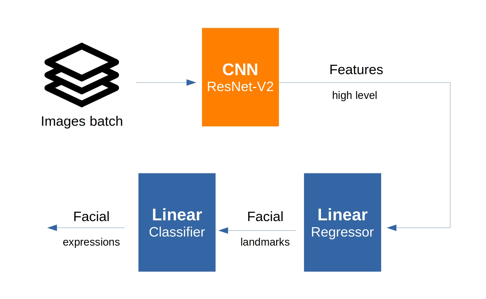
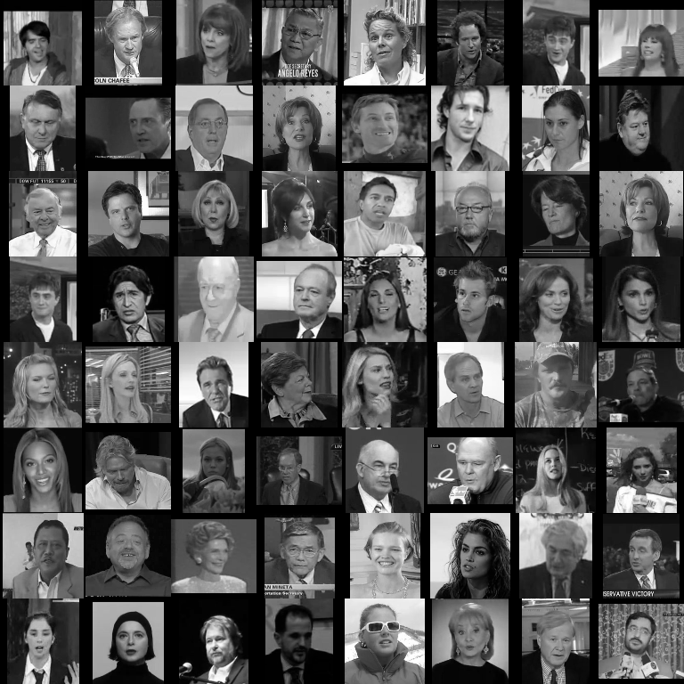
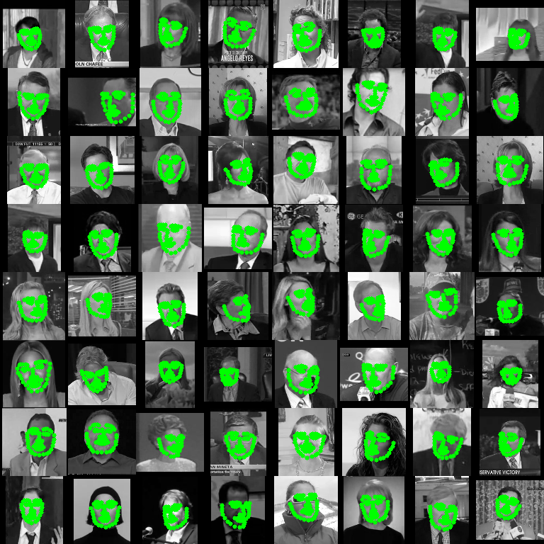
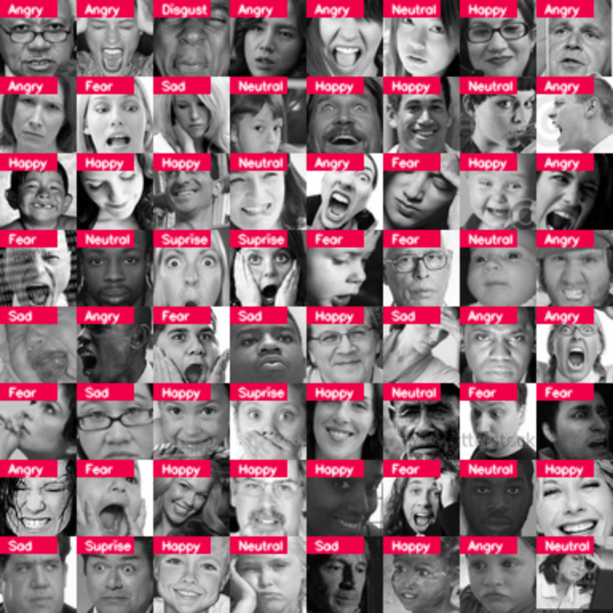

# FaceRecognition
Face Detection and Recognition  | under development
   

- # Architecture

   

- # Pipeline
    - Resizeing raw sample images  to 96 x 96
    <table>
        <tr>
            <td></td>
            <td></td>
        </tr>
        <tr>
            <td></td>
            <td></td>
        </tr>
    </table>
      
        
    <h2>Resized batch of 128x96x96x1<h2>
    <td></td> 
    <h2>Resized with landmarks overlayed<h2>
    <td></td> 
    <h2>Resized batch of 64x48x48x1 of expressions dataset<h2>
    <td></td> 
